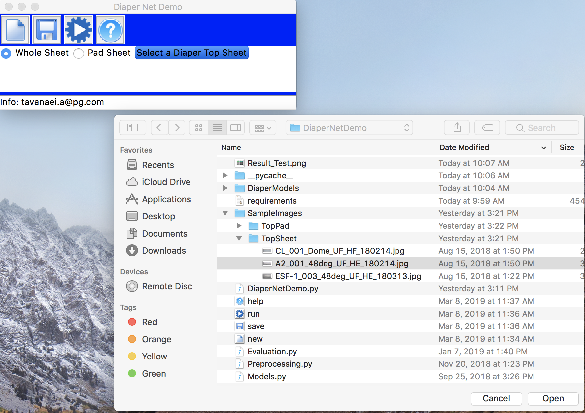

# DiaperNet Demo
*****
Requirements:

- Python 3+
- All libraries are mentioned in the requirements.txt

*****

## Run:

$python DiaperNetDemo.py

## Step 1:
Select either a whole sheet or a pad (Sample images are in the "SampleImages" folder)

## Step 2:
Click RUN (CPU takes 4 seconds, GPU takes 1s)

## Step 3:
After maps are shown, Click SAVE to save the results 

## Help needed?
Help Menu or

## You wanna try a new one?

### Note:
Each toolbar botton has a menu botton as well

# The End